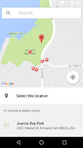

## PlacePicker

The `PlacePicker` provides a UI dialog that displays an interactive map and a list of nearby places, including places corresponding to geographical addresses and local businesses. Users can choose a place, and your app can then retrieve the details of the selected place.



You can access the place picker through the `placePicker` function. Its syntax is:
```js
placePicker(options?: PlacePickerOptions | null): Promise<Place>
```

where `options` is a plain object with the following optional properties:

Property | Type                     | Description
---------|--------------------------|------------
bounds   | `LatLngBounds` or `LatLng[]` | Determines the coordinates of the initial viewport.
useLastBounds | boolean | `true` to use the viewport of the map at the time the user's last selection was made.

#### Types

```js
  LatLng {
    latitude: number,
    longitude: number
  }

  LatLngBounds {
    southwest: LatLng,
    northeast: LatLng
  }
```

### Example
```js
import { placePicker } from 'react-native-google-places-ui'
  //...

  setResult(place) {
    console.log('Place:', place)
    this.setState({ place })
  }

  handleError(error) {
    if (error.code !== 'RESULT_CANCELED') {
      console.warn(`${error.code}: ${error.message}`)
    }
  }

  // uses the last viewport as initial bounds
  selectLocation() {
    placePicker({ useLastBounds: true })
      .then(this.setResult)
      .catch(this.handleError)
  }
```
