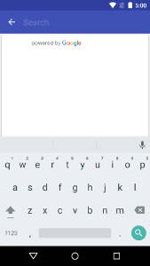

# React Native Google Places UI

[![npm][npm-image]](https://www.npmjs.com/package/react-native-google-places-ui)
[![License][license-image]](LICENSE)

React native implementation of the Google Places UI widgets (only for Android for now).

In my country (México), software developers are poorly paid, so I have had to look for another job to earn a living and I cannot dedicate more time to maintaining this and other repositories that over the years have never generated any money for me. If anyone is interested in maintaining this repository, I'd be happy to transfer it to them, along with the associated npm package. |
:---: |
En mi país (México), los desarrolladores de software somos pésimamente pagados, por lo que he tenido que buscar otro trabajo para ganarme la vida y no puedo dedicar más tiempo a mantener éste y otros repositorios que a través de los años nunca me generaron dinero. Si a alguien le interesa dar mantenimiento a este repositorio, con gusto se lo transferiré, así como el paquete de npm asociado. |





Requeriments:

- React Native v0.57.0 or later (not tested with previous versions).
- Gradle Gradle 4.6 or later
- `ACCESS_FINE_LOCATION` permission.

react-native-google-places-ui can use global "ext" variables for its configuration.

The variables and their defaults:

- `playServicesPlacesVersion` : '16.0.0'
- `googlePlayServicesMapsVersion` : '16.0.0'
- `buildToolsVersion` : '28.0.3'
- `minSdkVersion` : 21
- `compileSdkVersion` : 28
- `targetSdkVersion` : 28
- `supportLibVersion` : '28.0.0'

Study [the example](https://github.com/aMarCruz/react-native-google-places-ui/tree/master/examples/placesuidemo) to know how to setup this versions.

## Install

1. Install the wrapper from npm and link it:

    ```bash
    yarn add react-native-google-places-ui
    react-native link react-native-google-places-ui
    ```

2. Ensure that 'implementation' is used in your android/app/build.gradle. It must looks like:

    ```gradle
    implementation project(':react-native-google-places-ui')
    ```

3. Go to the [Google API Console](https://console.developers.google.com), enable "Google Places API for Android" in your App and get an API key __with Android restrictions__.

    Add your API key to your android/app/src/main/AndroidManifest.xml inside the `application` tag, as shown in the following code sample, replacing `YOUR_API_KEY` with your own API key:

    ```xml
    <uses-permission android:name="android.permission.ACCESS_FINE_LOCATION" />

    <application ...>
        ...
        <meta-data
            android:name="com.google.android.geo.API_KEY"
            android:value="YOUR_API_KEY" />
    </application>
    ```

    See [the example](https://github.com/aMarCruz/react-native-google-places-ui/tree/master/examples/placesuidemo) to know how to configure rn-google-places-ui and the new Gradle plugin.

    See more on [Get API Key and Signup](https://developers.google.com/places/android-sdk/signup) on the Google docs.

## PlaceAutocomplete

The autocomplete widget is a search dialog with built-in autocomplete functionality. As a user enters search terms, the widget presents a list of predicted places to choose from. When the user makes a selection, a `Place` instance is returned, which your app can then use to get details about the selected place.

See the [placeAutocomplete](PlaceAutocomplete.md) doc to learn more.

## PlacePicker

The `PlacePicker` provides a UI dialog that displays an interactive map and a list of nearby places, including places corresponding to geographical addresses and local businesses. Users can choose a place, and your app can then retrieve the details of the selected place.

See the [placePicker](PlacePicker.md) doc to learn more.

## Place

Both placeAutocomplete and placePicker returns a Promise that resolves to a `Place` object with this properties:

Property | Type                     | Description
---------|--------------------------|------------
address  | string | Human readable address for this Place. May be empty if the address is unknown.<br>The address is localized according to the locale property.
attributions | string or undefined | The attributions to be shown to the user if data from the `Place` is used.<br>Google recommends placing this information below any place information.
id | string | Unique id of this place.<br>This ID can be passed to the Places API to lookup the same place at a later time, but it is not guaranteed that such a lookup will succeed (the place may no longer exist in the database). It is possible that the returned Place in such a lookup will have a different ID (so there may be multiple ID's for one given place).
latlng | `LatLng` | Location of this Place.<br>The location is not necessarily the center of the Place, or any particular entry or exit point, but some arbitrarily chosen point within the geographic extent of the Place.
locale | string or undefined | The locale in which the names and addresses were localized.
name | string | Name of this Place.<br>The name is localized according to the locale property.
phoneNumber | string or undefined | The place's phone number in international format, `undefined` if no phone number is known or the place has no phone number.<br>International format includes the country code, and is prefixed with the plus (+) sign. For example, the international phone number for Google's Mountain View, USA office is +1 650-253-0000.
placeTypes | string[] | List of place types for this Place.
priceLevel | number | The price level on a scale from 0 to 4 or a negative value if no price level is known.<br>The exact amount indicated by a specific value will vary from region to region. Price levels are interpreted as follows:<br>0 — Free<br>1 — Inexpensive<br>2 — Moderate<br>3 — Expensive<br>4 — Very Expensive
rating | number | Place's rating, from 1.0 to 5.0, based on aggregated user reviews, or a negative value if no rating is known.
viewport | `LatLngBounds` or undefined | Viewport of a size that is suitable for displaying this Place.<br>For example, a Place representing a store may have a relatively small viewport, while a Place representing a country may have a very large viewport.<br>May be undefined if the size of the place is not known.
website | string or undefined | The URI of the website of this place or `undefined` if no website is known.<br>This is the URI of the website maintained by the Place, if available. Note this is a third-party website not affiliated with the Places API.

## TODO

- [X] Example
- [ ] Detection of Google Play Services
- [ ] iOS support

## Support my Work

I'm a full-stack developer with more than 20 year of experience and I try to share most of my work for free and help others, but this takes a significant amount of time and effort so, if you like my work, please consider...

[][kofi-url]

Of course, feedback, PRs, and stars are also welcome 🙃

Thanks for your support!

[npm-image]:      https://img.shields.io/npm/v/react-native-google-places-ui.svg
[license-image]:  https://img.shields.io/npm/l/express.svg
[kofi-url]:       https://ko-fi.com/C0C7LF7I
